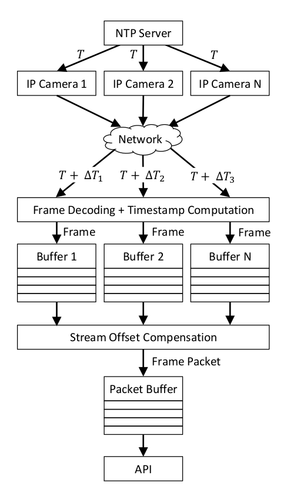

# Video Stream Synchronizer

Stream-Synchronizer is a C++/Python library for synchronized retrieval of video frames from multiple IP network cameras (via Real Time Streaming Protocol). A call to the provided `get_frame_packet()` method yields a packet containing one video frame per camera. These frames are guaranteed to have been captured at approximately the same wall time, thus representing the scene at the same point in time.

A usage example can be found in `stream_sync_test.py`.

## Quickstart

Stream-Synchronizer depends on the [H.264 Motion Vector Capture](https://github.com/LukasBommes/sfmt-videocap) library. The latest stable version is automatically pulled and installed in the provided Dockerfile.

To install the sfmt-streamsync module simply build the Docker image with
```
sudo docker-compose build
```
and run the container with
```
sudo docker-compose up -d
```
Now, start an interactive shell session in the container via
```
sudo docker exec -it stream_sync_dev
```
Edit the camera source URLs in `stream_sync_test.py` to match those of your IP cameras and run the example with
```
python3 stream_sync_test.py
```
If everything works well, a graphics window showing the live stream for each camera should pop up. The streams within these windows should be synchronized which can be validated easily if the frame timestamps are shown as overlays on the video. Most IP cameras provide an option for this.


## Python API


## Algorithm Overview

<center>

</center>


## About

This software is written by **Lukas Bommes, M.Sc.** - [A*Star SIMTech, Singapore](https://www.a-star.edu.sg/simtech)<br>
It is based on [MV-Tractus](https://github.com/jishnujayakumar/MV-Tractus/tree/master/include) and OpenCV's [videoio module](https://github.com/opencv/opencv/tree/master/modules/videoio).


#### License

This project is licensed under the MIT License - see the [LICENSE](LICENSE) file for details.
